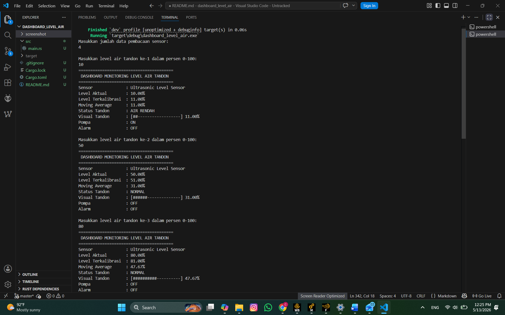
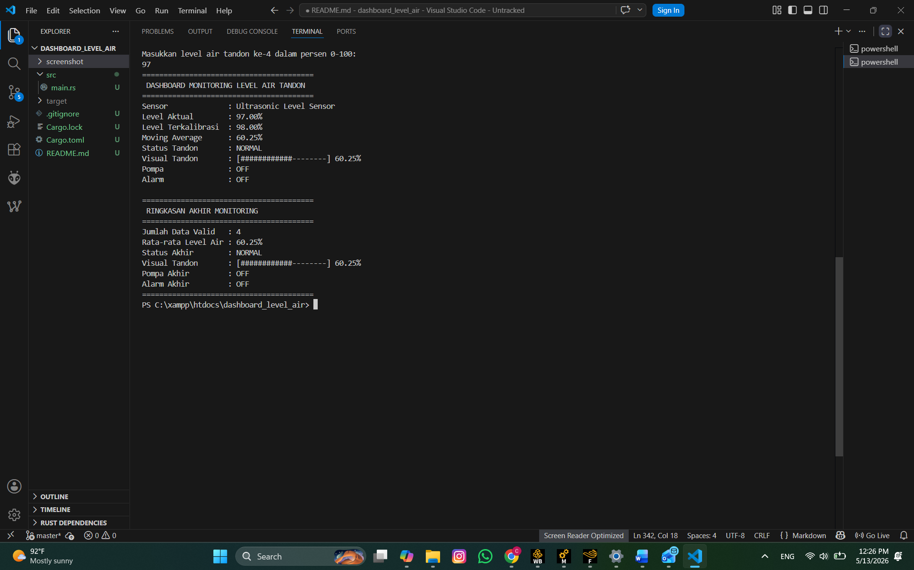

# Dashboard Monitoring Level Air Tandon Gedung Berbasis Rust

## Deskripsi Project

Project ini merupakan aplikasi terminal berbasis Rust yang digunakan untuk memonitor level air pada tandon gedung. Sistem menerima input berupa level air dalam satuan persen, kemudian melakukan validasi data, kalibrasi sederhana, perhitungan moving average, penentuan status tandon, serta kontrol pompa dan alarm secara otomatis.

Project ini dibuat untuk memenuhi tugas Evaluasi Tengah Semester mata kuliah Algoritma dan Pemrograman dengan tema sistem pengukuran dan kontrol pada bidang instrumentasi.

## Studi Kasus

Pada gedung bertingkat, tandon air digunakan sebagai tempat penyimpanan air sebelum dialirkan ke berbagai bagian gedung. Level air pada tandon perlu dipantau agar tidak terlalu rendah dan tidak melebihi batas aman.

Jika level air terlalu rendah, maka pompa harus menyala untuk mengisi tandon. Jika level air terlalu tinggi, maka sistem harus memberikan peringatan overflow agar tidak terjadi luapan air.

Oleh karena itu, dibuat sistem monitoring level air tandon gedung berbasis terminal menggunakan bahasa Rust.

## Tujuan Project

Tujuan dari project ini adalah:

1. Membuat program monitoring level air tandon berbasis Rust.
2. Mengimplementasikan input sensor level air.
3. Menggunakan validasi data sensor.
4. Menggunakan percabangan untuk menentukan status tandon.
5. Menggunakan perulangan untuk membaca beberapa data sensor.
6. Menggunakan konsep OOP dalam Rust melalui `struct` dan `impl`.
7. Mengimplementasikan komputasi numerik berupa moving average.
8. Mengontrol pompa dan alarm secara otomatis berdasarkan level air.

## Fitur Program

Program ini memiliki beberapa fitur utama, yaitu:

- Input level air tandon dalam persen.
- Validasi input agar hanya menerima data 0 sampai 100 persen.
- Kalibrasi sensor sederhana menggunakan offset.
- Perhitungan moving average dari data level air.
- Penentuan status tandon secara otomatis.
- Kontrol pompa otomatis saat air rendah.
- Alarm overflow saat air melebihi batas aman.
- Visualisasi level air dalam bentuk bar terminal.
- Ringkasan akhir hasil monitoring.
- Implementasi konsep OOP menggunakan `struct` dan `impl`.

## Aturan Status Level Air

| Level Air | Status | Pompa | Alarm |
|---|---|---|---|
| 0–20% | Air rendah | ON | OFF |
| 21–80% | Normal | OFF | OFF |
| 81–95% | Hampir penuh | OFF | OFF |
| 96–100% | Overflow warning | OFF | ON |

## Alur Kerja Sistem

Alur kerja sistem adalah sebagai berikut:

1. Program dimulai.
2. Sistem menginisialisasi sensor level air.
3. Sistem menginisialisasi controller pompa dan alarm.
4. User memasukkan jumlah data pembacaan sensor.
5. User memasukkan nilai level air dalam persen.
6. Program memvalidasi nilai input.
7. Jika input tidak valid, program menampilkan pesan error.
8. Jika input valid, program melakukan kalibrasi sensor.
9. Data hasil kalibrasi disimpan ke dalam vector.
10. Program menghitung moving average.
11. Program menentukan status tandon berdasarkan moving average.
12. Program mengatur pompa dan alarm.
13. Program menampilkan dashboard monitoring.
14. Setelah semua data diproses, program menampilkan ringkasan akhir.

## Konsep OOP

Program ini menggunakan konsep OOP dalam Rust melalui penggunaan `struct` dan `impl`.

### 1. Sensor

Struct `Sensor` digunakan untuk merepresentasikan sensor level air.

Atribut yang digunakan:

- `name`: menyimpan nama sensor.
- `value`: menyimpan nilai pembacaan level air.
- `offset`: menyimpan nilai offset untuk kalibrasi sensor.

Method yang digunakan:

- `new()`: membuat objek sensor baru.
- `read_value()`: membaca nilai input sensor.
- `calibrated_value()`: menghitung nilai sensor setelah dikalibrasi.

### 2. Controller

Struct `Controller` digunakan untuk mengatur kondisi pompa dan alarm.

Atribut yang digunakan:

- `pump`: menyimpan status pompa.
- `alarm`: menyimpan status alarm.

Method yang digunakan:

- `new()`: membuat objek controller baru.
- `control()`: menentukan status pompa dan alarm berdasarkan level air.
- `pump_status()`: menampilkan status pompa.
- `alarm_status()`: menampilkan status alarm.

### 3. MonitoringSystem

Struct `MonitoringSystem` digunakan sebagai sistem utama yang menggabungkan sensor, controller, dan data hasil pembacaan sensor.

Atribut yang digunakan:

- `sensor`: objek sensor level air.
- `controller`: objek controller pompa dan alarm.
- `data`: vector untuk menyimpan data level air yang sudah dikalibrasi.

Method yang digunakan:

- `new()`: membuat objek sistem monitoring baru.
- `add_data()`: menambahkan data level air ke sistem.
- `moving_average()`: menghitung rata-rata data level air.
- `data_count()`: menghitung jumlah data valid yang diproses.

## Komputasi Numerik

Komputasi numerik yang digunakan pada project ini adalah **Moving Average**.

Moving average digunakan untuk menghitung rata-rata dari beberapa data level air yang telah dikalibrasi. Tujuan penggunaan moving average adalah agar hasil monitoring lebih stabil dan tidak terlalu dipengaruhi oleh perubahan data sesaat.

Rumus moving average:

```text
Moving Average = jumlah seluruh data / banyak data
```

Contoh perhitungan:

```text
Data level air terkalibrasi = 11, 51, 91

Moving Average = (11 + 51 + 91) / 3
Moving Average = 153 / 3
Moving Average = 51
```

Berdasarkan hasil moving average sebesar 51%, maka status tandon adalah normal.

## Kalibrasi Sensor

Program menggunakan kalibrasi sederhana dengan menambahkan nilai offset pada data input sensor.

Rumus kalibrasi:

```text
Level Terkalibrasi = Level Aktual + Offset
```

Contoh:

```text
Level aktual = 50%
Offset = 1%

Level terkalibrasi = 50 + 1
Level terkalibrasi = 51%
```

## Teknologi yang Digunakan

- Bahasa pemrograman: Rust
- Editor: Visual Studio Code
- Build tool: Cargo
- Version control: Git dan GitHub

## Struktur Project

```text
dashboard_level_air/
├── src/
│   └── main.rs
├── screenshot/
│   └── hasil_program.png
├── README.md
├── Cargo.toml
└── Cargo.lock
```

## Cara Menjalankan Program

Pastikan Rust sudah terinstall pada komputer.

Cek versi Rust dan Cargo:

```bash
rustc --version
cargo --version
```

Clone repository atau buka folder project, lalu jalankan perintah:

```bash
cargo run
```

## Contoh Penggunaan Program

Contoh input:

```text
Masukkan jumlah data pembacaan sensor:
3

Masukkan level air tandon ke-1 dalam persen 0-100:
10

Masukkan level air tandon ke-2 dalam persen 0-100:
50

Masukkan level air tandon ke-3 dalam persen 0-100:
90
```

Contoh proses perhitungan:

```text
Data 1:
Level aktual = 10%
Offset = 1%
Level terkalibrasi = 11%

Data 2:
Level aktual = 50%
Offset = 1%
Level terkalibrasi = 51%

Data 3:
Level aktual = 90%
Offset = 1%
Level terkalibrasi = 91%

Moving Average = (11 + 51 + 91) / 3
Moving Average = 51%
```

Contoh output akhir:

```text
========================================
 RINGKASAN AKHIR MONITORING 
========================================
Jumlah Data Valid   : 3
Rata-rata Level Air : 51.00%
Status Akhir        : NORMAL
Visual Tandon       : [##########----------] 51.00%
Pompa Akhir         : OFF
Alarm Akhir         : OFF
========================================
```

## Contoh Status Program

### 1. Air Rendah

Jika level air berada pada rentang 0–20%, maka status tandon adalah air rendah.

```text
Status Tandon : AIR RENDAH
Pompa         : ON
Alarm         : OFF
```

### 2. Normal

Jika level air berada pada rentang 21–80%, maka status tandon adalah normal.

```text
Status Tandon : NORMAL
Pompa         : OFF
Alarm         : OFF
```

### 3. Hampir Penuh

Jika level air berada pada rentang 81–95%, maka status tandon adalah hampir penuh.

```text
Status Tandon : HAMPIR PENUH
Pompa         : OFF
Alarm         : OFF
```

### 4. Overflow Warning

Jika level air berada pada rentang 96–100%, maka status tandon adalah overflow warning.

```text
Status Tandon : OVERFLOW WARNING
Pompa         : OFF
Alarm         : ON
```

## Screenshot Program

### Screenshot 1


### Screenshot 2


## Penjelasan Singkat Program

Program dimulai dengan membuat objek `Sensor`, `Controller`, dan `MonitoringSystem`. User memasukkan jumlah data pembacaan sensor, kemudian memasukkan nilai level air dalam persen.

Setiap data yang dimasukkan akan divalidasi agar berada pada rentang 0 sampai 100 persen. Data valid akan dikalibrasi menggunakan offset, lalu disimpan ke dalam vector. Setelah itu, program menghitung moving average dari seluruh data yang sudah masuk.

Hasil moving average digunakan untuk menentukan status tandon, visualisasi tandon, status pompa, dan status alarm. Jika air rendah, pompa menyala. Jika air terlalu tinggi, alarm menyala sebagai peringatan overflow.

## Kesimpulan

Project ini berhasil membuat sistem monitoring level air tandon gedung berbasis Rust. Program mampu membaca input level air, melakukan validasi data, melakukan kalibrasi sederhana, menghitung moving average, menentukan status tandon, serta mengontrol pompa dan alarm secara otomatis.

Dengan adanya visualisasi level air dalam terminal, program menjadi lebih mudah dipahami dan dapat digunakan sebagai simulasi sistem instrumentasi sederhana.

## Anggota Kelompok

1. Nama:CRAFFTY HANA M.C.
   NRP:2042251054

2. Nama:TIARA HEMAS E.P.
   NRP:2042251019