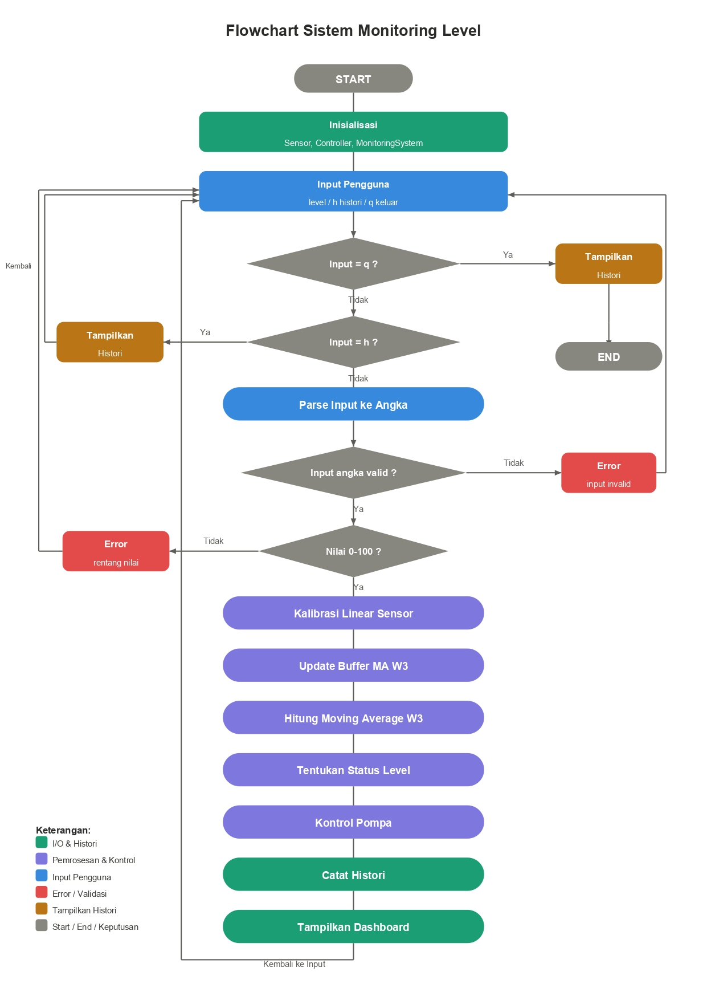
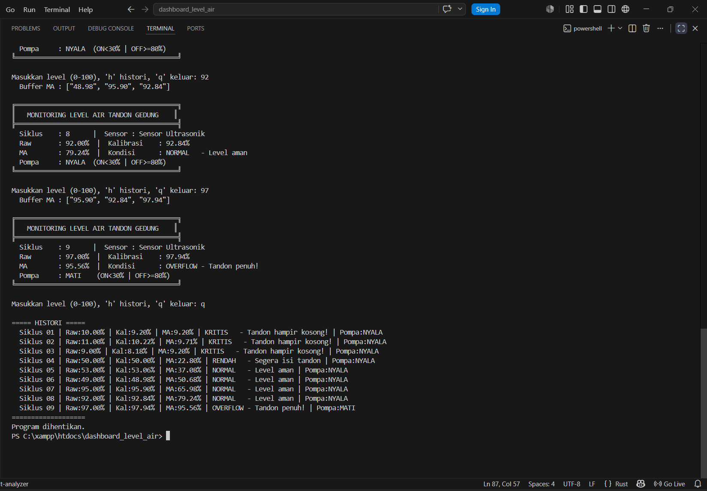

# Sistem Monitoring Level Air Tandon Gedung Berbasis Rust

## Deskripsi Project

Project ini merupakan aplikasi terminal berbasis Rust yang digunakan untuk memonitor level air pada tandon gedung. Sistem menerima input level air dalam satuan persen, melakukan validasi data, melakukan kalibrasi linear sensor, menghitung sliding moving average dengan 3 data terakhir, menentukan status level air, serta mengontrol pompa secara otomatis.

Program berjalan secara berulang sampai user mengetik `q`. User juga dapat mengetik `h` untuk menampilkan histori pembacaan sensor yang sudah diproses.

Project ini dibuat untuk memenuhi tugas Evaluasi Tengah Semester mata kuliah Algoritma dan Pemrograman dengan tema sistem pengukuran dan kontrol pada bidang instrumentasi.

## Studi Kasus

Pada gedung bertingkat, tandon air digunakan sebagai tempat penyimpanan air sebelum dialirkan ke berbagai bagian gedung. Level air pada tandon perlu dipantau agar tidak terlalu rendah dan tidak melebihi batas aman.

Jika level air terlalu rendah, pompa perlu menyala untuk mengisi tandon. Jika level air sudah cukup tinggi, pompa harus dimatikan agar tandon tidak terlalu penuh. Oleh karena itu, dibuat sistem monitoring level air tandon gedung berbasis terminal menggunakan bahasa Rust.

## Tujuan Project

Tujuan dari project ini adalah:

1. Membuat program monitoring level air tandon berbasis Rust.
2. Mengimplementasikan input sensor level air secara berulang.
3. Menggunakan validasi data sensor.
4. Menggunakan kalibrasi linear sensor.
5. Menggunakan sliding moving average 3 data terakhir.
6. Menggunakan percabangan untuk menentukan status level air.
7. Menggunakan perulangan agar program terus menerima input sampai dihentikan user.
8. Menggunakan konsep OOP dalam Rust melalui `struct` dan `impl`.
9. Mengontrol pompa secara otomatis berdasarkan hasil moving average.

## Fitur Program

Program ini memiliki beberapa fitur utama, yaitu:

- Input level air tandon dalam persen secara berulang.
- Program berhenti ketika user mengetik `q`.
- User dapat mengetik `h` untuk menampilkan histori pembacaan.
- Validasi input agar hanya menerima data 0 sampai 100 persen.
- Kalibrasi linear sensor menggunakan rumus `(raw × 1.02) - 1.0`.
- Perhitungan sliding moving average menggunakan 3 data terakhir.
- Penentuan status level air berdasarkan hasil moving average.
- Kontrol pompa otomatis berdasarkan batas bawah dan batas atas.
- Penyimpanan histori pembacaan sensor.
- Tampilan dashboard monitoring pada terminal.
- Implementasi konsep OOP menggunakan `struct` dan `impl`.

## Aturan Status Level Air

Status level air ditentukan berdasarkan nilai moving average.

| Moving Average | Status | Keterangan |
|---|---|---|
| 0–9% | KRITIS | Tandon hampir kosong |
| 10–29% | RENDAH | Segera isi tandon |
| 30–79% | NORMAL | Level aman |
| 80–89% | TINGGI | Mendekati penuh |
| 90–100% | OVERFLOW | Tandon penuh |

## Aturan Kontrol Pompa

Kontrol pompa dilakukan berdasarkan hasil moving average.

| Kondisi Moving Average | Status Pompa |
|---|---|
| MA < 30% | Pompa NYALA |
| MA >= 80% | Pompa MATI |
| 30% <= MA < 80% | Pompa mempertahankan kondisi terakhir |

Penggunaan dua batas ini bertujuan agar pompa tidak terlalu sering berubah status saat level air berada di area tengah.

## Alur Kerja Sistem

Alur kerja sistem adalah sebagai berikut:

1. Program dimulai.
2. Sistem menginisialisasi `Sensor`, `Controller`, dan `MonitoringSystem`.
3. User memasukkan level air, mengetik `h` untuk histori, atau mengetik `q` untuk keluar.
4. Jika input adalah `q`, program menampilkan histori dan berhenti.
5. Jika input adalah `h`, program menampilkan histori dan kembali meminta input.
6. Jika input bukan angka, program menampilkan pesan error.
7. Jika input angka berada di luar rentang 0 sampai 100, program menampilkan pesan error.
8. Jika input valid, sensor menyimpan nilai raw.
9. Sensor melakukan kalibrasi linear.
10. Nilai kalibrasi dimasukkan ke buffer moving average.
11. Jika buffer lebih dari 3 data, data paling lama dihapus.
12. Program menghitung moving average dari maksimal 3 data terakhir.
13. Program menentukan status level air berdasarkan moving average.
14. Controller mengatur pompa berdasarkan moving average.
15. Sistem mencatat hasil pembacaan ke histori.
16. Program menampilkan dashboard monitoring.
17. Program kembali meminta input berikutnya.

## Flowchart Sistem



## Konsep OOP

Program ini menggunakan konsep OOP dalam Rust melalui penggunaan `struct` dan `impl`.

### 1. Sensor

Struct `Sensor` digunakan untuk merepresentasikan sensor level air.

Atribut yang digunakan:

- `nama`: menyimpan nama sensor.
- `nilai_raw`: menyimpan nilai pembacaan sensor sebelum kalibrasi.
- `nilai_kal`: menyimpan nilai sensor setelah kalibrasi.
- `error`: menyimpan status validasi input.
- `buffer`: menyimpan maksimal 3 data kalibrasi terbaru untuk moving average.

Method yang digunakan:

- `baru()`: membuat objek sensor baru.
- `set_nilai()`: menerima input sensor, melakukan validasi, dan melakukan kalibrasi.
- `moving_average()`: menghitung sliding moving average 3 data terakhir.
- `status()`: menentukan status level air berdasarkan moving average.

### 2. Controller

Struct `Controller` digunakan untuk mengatur status pompa.

Atribut yang digunakan:

- `batas_bawah`: batas bawah untuk menyalakan pompa.
- `batas_atas`: batas atas untuk mematikan pompa.
- `pompa`: menyimpan status pompa.

Method yang digunakan:

- `baru()`: membuat objek controller baru.
- `update()`: mengatur status pompa berdasarkan moving average.

### 3. MonitoringSystem

Struct `MonitoringSystem` digunakan untuk menyimpan siklus pembacaan dan histori monitoring.

Atribut yang digunakan:

- `siklus`: menyimpan jumlah siklus pembacaan valid.
- `histori`: menyimpan riwayat pembacaan sensor.

Method yang digunakan:

- `baru()`: membuat objek monitoring baru.
- `catat()`: mencatat hasil pembacaan sensor ke histori.
- `tampilkan()`: menampilkan dashboard monitoring.
- `histori()`: menampilkan seluruh histori pembacaan.

## Komputasi Numerik

Komputasi numerik yang digunakan pada project ini adalah **sliding moving average dengan window 3 data terakhir**.

Sliding moving average digunakan untuk menghitung rata-rata dari maksimal tiga data level air terbaru yang telah dikalibrasi. Tujuannya adalah agar hasil monitoring lebih stabil terhadap noise sensor, tetapi tetap responsif terhadap perubahan level air.

Rumus:

```text
Sliding Moving Average = jumlah data pada window / banyak data pada window
```

Contoh perhitungan:

```text
Input level air = 10, 50, 90, 98
```

Kalibrasi linear menggunakan rumus:

```text
nilai_kal = (nilai_raw × 1.02) - 1.0
```

Hasil kalibrasi:

```text
10 → 9.20
50 → 50.00
90 → 90.80
98 → 98.96
```

Karena window = 3, maka data yang digunakan adalah 3 data terakhir:

```text
50.00, 90.80, 98.96
```

Perhitungan moving average:

```text
Sliding Moving Average = (50.00 + 90.80 + 98.96) / 3
Sliding Moving Average = 79.92
```

Berdasarkan hasil moving average sebesar 79.92%, status level air adalah normal.

## Kalibrasi Sensor

Program menggunakan kalibrasi linear sederhana.

Rumus kalibrasi:

```text
nilai_kalibrasi = (nilai_raw × gain) + offset
```

Pada project ini digunakan:

```text
gain = 1.02
offset = -1.0
```

Sehingga rumusnya menjadi:

```text
nilai_kalibrasi = (nilai_raw × 1.02) - 1.0
```

Contoh:

```text
nilai_raw = 50
nilai_kalibrasi = (50 × 1.02) - 1.0
nilai_kalibrasi = 50.00
```

Kalibrasi ini digunakan untuk mensimulasikan koreksi sederhana pada pembacaan sensor.

## Teknologi yang Digunakan

- Bahasa pemrograman: Rust
- Editor: Visual Studio Code
- Build tool: Cargo
- Version control: Git dan GitHub

## Struktur Project

```text
dashboard_level_air/
├── src/
│   └── main.rs
├── screenshot/
│   ├── hasil_program1.png
│   └── hasil_program2.png
│   └── hasil_program3.png
├── flowchart/
│   └── flowchart_sistem.png
├── laporan/
│   ├── laporan.tex
│   └── laporan_dashboard_level_air.pdf
├── README.md
├── Cargo.toml
└── Cargo.lock
```

## Cara Menjalankan Program

Pastikan Rust sudah terinstall pada komputer.

Cek versi Rust dan Cargo:

```bash
rustc --version
cargo --version
```

Jalankan program:

```bash
cargo run
```

## Contoh Penggunaan Program

Contoh input:

```text
Masukkan level (0-100), 'h' histori, 'q' keluar: 10
Masukkan level (0-100), 'h' histori, 'q' keluar: 50
Masukkan level (0-100), 'h' histori, 'q' keluar: 90
Masukkan level (0-100), 'h' histori, 'q' keluar: 98
Masukkan level (0-100), 'h' histori, 'q' keluar: h
Masukkan level (0-100), 'h' histori, 'q' keluar: q
```

Contoh output dashboard:

```text
╔══════════════════════════════════════════╗
║   MONITORING LEVEL AIR TANDON GEDUNG    ║
╠══════════════════════════════════════════╣
  Siklus    : 4      |  Sensor : Sensor Ultrasonik
  Raw       : 98.00% |  Kalibrasi    : 98.96%
  MA        : 79.92% |  Kondisi      : NORMAL   - Level aman
  Pompa     : MATI   (ON<30% | OFF>=80%)
╚══════════════════════════════════════════╝
```

Contoh histori:

```text
===== HISTORI =====
  Siklus 01 | Raw:10.00% | Kal:9.20% | MA:9.20% | KRITIS   - Tandon hampir kosong! | Pompa:NYALA
  Siklus 02 | Raw:50.00% | Kal:50.00% | MA:29.60% | RENDAH   - Segera isi tandon | Pompa:NYALA
  Siklus 03 | Raw:90.00% | Kal:90.80% | MA:50.00% | NORMAL   - Level aman | Pompa:NYALA
  Siklus 04 | Raw:98.00% | Kal:98.96% | MA:79.92% | NORMAL   - Level aman | Pompa:NYALA
===================
```

## Screenshot Program

### Screenshot 1


### Screenshot 2


### Screenshot 3



## Penjelasan Singkat Program

Program dimulai dengan membuat objek `Sensor`, `Controller`, dan `MonitoringSystem`. User dapat memasukkan nilai level air, menampilkan histori dengan perintah `h`, atau menghentikan program dengan perintah `q`.

Setiap input level air divalidasi agar berada pada rentang 0 sampai 100 persen. Jika input valid, sensor melakukan kalibrasi linear, kemudian data kalibrasi dimasukkan ke buffer moving average. Buffer hanya menyimpan maksimal tiga data terbaru.

Hasil moving average digunakan untuk menentukan status level air dan mengontrol pompa. Jika moving average kurang dari 30%, pompa menyala. Jika moving average mencapai 80% atau lebih, pompa mati.

Setiap pembacaan valid dicatat ke histori agar user dapat melihat riwayat monitoring selama program berjalan.

## Kesimpulan

Project ini berhasil membuat sistem monitoring level air tandon gedung berbasis Rust. Program mampu membaca input level air secara berulang, melakukan validasi data, melakukan kalibrasi linear sensor, menghitung sliding moving average 3 data terakhir, menentukan status level air, serta mengontrol pompa secara otomatis.

Dengan adanya histori pembacaan dan tampilan dashboard terminal, program menjadi lebih mudah dipahami dan dapat digunakan sebagai simulasi sistem instrumentasi sederhana.

## Anggota Kelompok

1. Nama: TIARA HEMAS E.P. 
   NRP: 2042251019

2. Nama: CRAFFTY HANA M.C.   
   NRP: 2042251054
